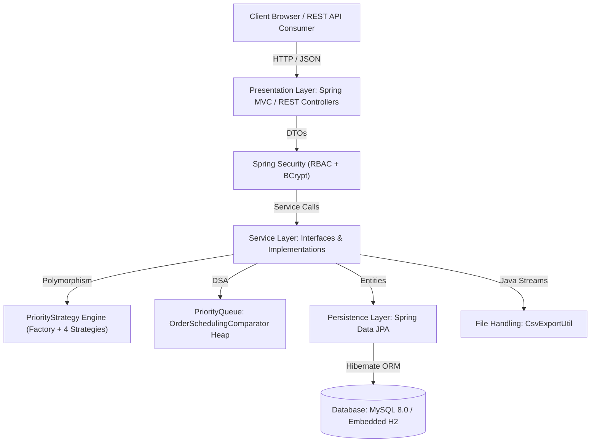
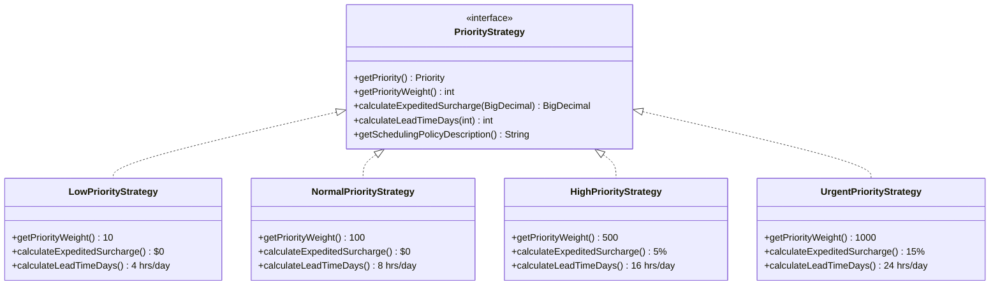
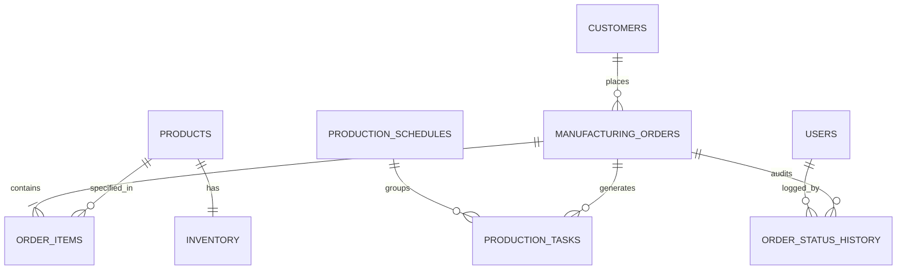
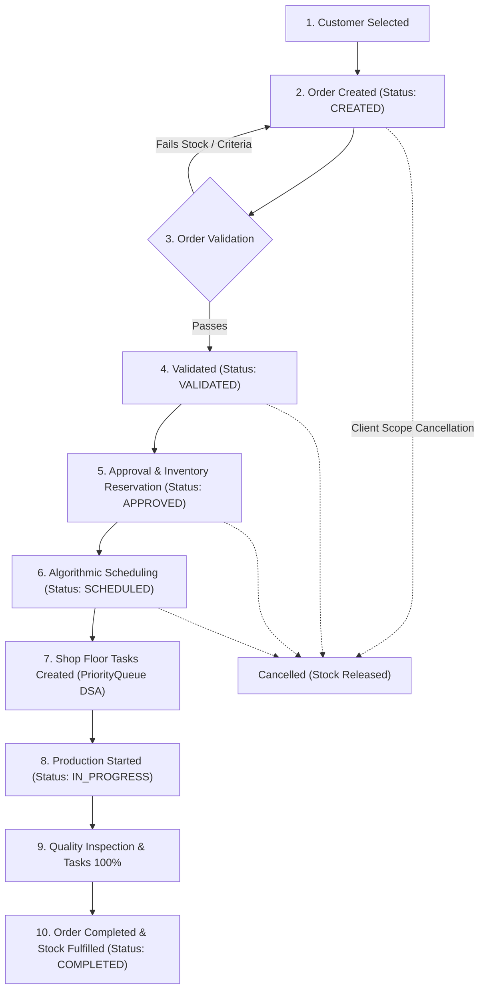

# Smart Manufacturing Order Processing System

[](https://github.com/uditpratapsingh/smart-manufacturing-order-processing-system/actions)


> **Academic Capstone / PBL Project**  
> **Course:** Object Oriented Techniques using Java (`CCSE0355`)  
> **Group / Team:** 91  
> **Branch & Degree:** B.Tech Computer Science & Engineering  
> **SDG Alignment:** SDG 9 – Industry, Innovation, and Infrastructure  

---

## 1. Overview

The **Smart Manufacturing Order Processing System** is an enterprise-grade manufacturing resource planning (MRP) and order execution platform designed to automate the lifecycle of industrial orders—from procurement and inventory allocation to algorithmic shop floor scheduling and dispatch.

Developed specifically to demonstrate **Advanced Object-Oriented Programming (OOP) and Data Structures & Algorithms (DSA) concepts in Java**, the application replaces manual legacy spreadsheets with an integrated, secure, and event-audited production pipeline.

---

## 2. Problem Statement

Conventional manufacturing facilities face critical operational friction points:
1. **Manual Order Entry & Calculations:** Disjointed manual record-keeping leads to human errors in billing, tax application, and customer order histories.
2. **Inefficient Order Prioritization:** Rush orders and high-value contracts are scheduled haphazardly using arbitrary database sorts or manual discretion, failing to balance deadlines against machine run-times.
3. **Inventory Mismatch & Overselling:** Disconnected inventory causes orders to be approved without verifiable stock reserves, causing abrupt stoppages on the assembly floor ("Insufficient Inventory").
4. **Limited Production Visibility:** Shop floor teams, supervisors, and sales representatives lack unified, real-time visibility into task completion rates, leading to unmonitored production bottlenecks and missed delivery deadlines.
5. **Coordination Overhead:** Lack of an audited lifecycle transition model results in inconsistent states between orders, products, and assigned work cells.

---

## 3. Project Objectives

* Provide automated, end-to-end management of customers, products, orders, and shop floor tasks.
* Enforce strict business validations and encapsulated state machine rules (Orders cannot bypass validation or approval).
* Implement polymorphic strategy patterns for multi-tier priority handling (`URGENT`, `HIGH`, `NORMAL`, `LOW`).
* Employ in-memory **Java PriorityQueue (DSA)** binary heap structures to schedule production batches by priority weight, delivery deadline, and workload duration.
* Guarantee real-time stock allocation and prevent negative or insufficient inventory.
* Deliver an intuitive, responsive executive web dashboard powered by Chart.js with rich CSV file export capabilities via Java I/O streams.

---

## 4. Technology Stack

* **Backend:**
  * Java 17 / 21 / 26
  * Spring Boot 3.2.5 (Spring MVC, Spring Data JPA, Spring Security)
  * Hibernate ORM 6.x
  * Jakarta Bean Validation (Hibernate Validator)
  * SLF4J / Logback Logging
* **Database & Persistence:**
  * MySQL 8.0 (Production & Docker)
  * H2 Database (Embedded zero-config profile for instant local development and test runs)
* **Frontend:**
  * Thymeleaf Template Engine
  * HTML5, CSS3, JavaScript (Vanilla ES6)
  * Bootstrap 5.3 & Bootstrap Icons
  * Chart.js 4.4 (Dynamic status, priority, and category visualizations)
* **Testing:**
  * JUnit 5 & Jupiter Engine
  * Mockito (Mocking & Argument Captors)
  * Spring Boot Test & MockMvc
* **Build & Deployment:**
  * Apache Maven
  * Docker & Docker Compose
  * GitHub Actions CI Pipeline

---

## 5. System Architecture

The project adheres to a clean, multi-tiered architecture that strictly separates responsibilities:



---

## 6. Java Object-Oriented Programming (OOP) Implementation

This project was built from the ground up to visibly demonstrate core Java OOP principles:

### A. Classes & Objects
Domain entities represent tangible elements of a real-world manufacturing plant:
* `Customer`: Industrial client accounts with contact details and order history.
* `Product`: Manufactured items specifying SKU, unit price, and fabrication hours.
* `Inventory`: Live stock levels, allocated stock, and reorder thresholds.
* `ManufacturingOrder`: The aggregate root tracking delivery deadlines, status, and financials.
* `OrderItem`: Line items linking specific products and quantities to orders.
* `ProductionTask`: Shop floor work packages assigned to specific workstations.
* `ProductionSchedule`: Time-window batches grouping tasks.
* `OrderStatusHistory`: Immutable audit entries capturing lifecycle state transitions.

### B. Encapsulation
* All entity fields are `private`.
* Access is managed through controlled getters and setters.
* **Invariant Protection:** Internal collections are protected using `Collections.unmodifiableList(...)` and `Collections.unmodifiableSet(...)`.
* Direct state mutations are forbidden; domain logic is encapsulated inside entities:
  * `ManufacturingOrder.recalculateTotals()`: Calculates subtotal, 8% VAT, and grand total on the backend.
  * `ManufacturingOrder.transitionTo(newStatus)`: Validates lifecycle state machine rules.
  * `Inventory.allocateStock(qty)`, `deductStock(qty)`, `releaseStock(qty)`: Guarantees stock cannot drop below zero.

### C. Inheritance
* **Mapped Superclass Inheritance:** All persistent domain entities inherit from the abstract `BaseEntity` class, providing centralized `id`, `createdAt`, `updatedAt`, `@PrePersist`, and `@PreUpdate` lifecycle callbacks.
* **Strategy Inheritance:** `PriorityStrategy` hierarchy implementing polymorphic interfaces.

### D. Abstraction
Every business component is partitioned behind an abstraction interface:
* `OrderService` &rarr; `OrderServiceImpl`
* `InventoryService` &rarr; `InventoryServiceImpl`
* `ProductionService` &rarr; `ProductionServiceImpl`
* `SchedulingService` &rarr; `SchedulingServiceImpl`
* `CustomerService` &rarr; `CustomerServiceImpl`
* `ProductService` &rarr; `ProductServiceImpl`
* `ReportService` &rarr; `ReportServiceImpl`
* `UserService` &rarr; `UserServiceImpl`

Controllers interact purely with interfaces, enabling loose coupling and modular unit testing.

### E. Polymorphism & Strategy Pattern
Priority handling is implemented using the **Strategy Pattern**:



* `PriorityStrategyFactory`: Dynamically registers and resolves the appropriate strategy at runtime using an `EnumMap`.

### F. Exception Handling
Custom domain exceptions provide centralized, meaningful diagnostics:
* `ResourceNotFoundException`, `CustomerNotFoundException`, `ProductNotFoundException`, `OrderNotFoundException`
* `InsufficientInventoryException`
* `InvalidOrderException`
* `InvalidOrderStatusException`
* `ProductionSchedulingException`
* `DuplicateResourceException`
* Handled globally via `@ControllerAdvice` (`GlobalExceptionHandler`), supporting both REST JSON error envelopes (`ApiResponse<T>`) and Thymeleaf flash alert banners.

### G. Collections & Data Structures (DSA)
* `java.util.List`: Maintains sequence order for line items and audit logs.
* `java.util.Set`: Stores unique security roles inside `User`.
* `java.util.Map` / `EnumMap`: Aggregates real-time metrics for Chart.js and maps priority strategies in `PriorityStrategyFactory`.
* `java.util.PriorityQueue`: Implements a **Binary Min/Max-Heap** to order manufacturing orders:
  * Evaluated through `OrderSchedulingComparator`.
  * Ranks orders by **Priority Strategy Weight (Urgent > High > Normal > Low)**.
  * Breaks ties using **Earliest Delivery Deadline**.
  * Resolves secondary ties using **FIFO Order Date**.

### H. File Handling
* `CsvExportUtil`: Streams formatted CSV documents directly through Java I/O (`PrintWriter`, `StringWriter`, `HttpServletResponse`) with character escaping for Orders, Production Tasks, Warehouse Inventory, and Customer Accounts.

---

## 7. Database Entity-Relationship Model



---

## 8. Application Business Workflow

An order undergoes a strict, unidirectional state transition lifecycle:



---

## 9. Demo Login Credentials

The application initializes five pre-configured user profiles with distinct roles and capabilities (passwords encrypted via BCrypt):

| Role | Username | Password | Department | Access Scope |
| :--- | :--- | :--- | :--- | :--- |
| **Administrator** | `admin` | `admin123` | Executive Leadership | Full system access, User registration, Global delete |
| **Production Manager** | `manager` | `manager123` | Production Operations | Production scheduling, Task updates, Order approvals |
| **Order Staff** | `staff` | `staff123` | Sales & Order Entry | Customer management, Order creation, Order validation |
| **Inventory Coordinator**| `inventory`| `inventory123`| Warehouse & Inventory | Product catalog, Stock adjustments, Material audits |
| **Supervisor** | `supervisor` | `supervisor123`| Quality & Oversight | Dashboards, Analytical reports, Monitoring |

> [!NOTE]  
> The login page features **one-click quick-fill buttons** for each demo role to facilitate instant academic evaluation.

---

## 10. Local Setup & Running Instructions

### Prerequisites
* Java JDK 17 or higher (`java -version`)
* Apache Maven 3.8+ (`mvn -version`)
* (Optional) MySQL 8.0 or Docker

### Option A: Direct Local Execution (Zero-Config Embedded H2)
The application is pre-configured with embedded MySQL-compatible storage, allowing immediate startup without needing a running MySQL server:

```bash
# 1. Clone repository
git clone https://github.com/uditpratapsingh/smart-manufacturing-order-processing-system.git
cd smart-manufacturing-order-processing-system

# 2. Build and run automated tests
mvn clean test

# 3. Start the Spring Boot application
mvn spring-boot:run
```
* Open your browser and navigate to: **`http://localhost:8080`**
* Log in using any demo account (e.g., `admin` / `admin123`).
* H2 Database Console is accessible at `http://localhost:8080/h2-console` (JDBC URL: `jdbc:h2:mem:smart_manufacturing`).

---

### Option B: Local Execution with MySQL 8
1. Create the MySQL database:
```sql
CREATE DATABASE smart_manufacturing_db;
```
2. Start the application with MySQL environment variables:
```bash
mvn spring-boot:run -Dspring-boot.run.arguments="--spring.profiles.active=mysql --DB_HOST=localhost --DB_PORT=3306 --DB_NAME=smart_manufacturing_db --DB_USERNAME=root --DB_PASSWORD=your_password"
```

---

### Option C: Docker & Docker Compose (Recommended Deployment)
To start both the MySQL 8 database container and the Spring Boot application container in a single command:

```bash
docker compose up --build
```
* Web Application: `http://localhost:8081`
* MySQL Database: `localhost:3307` (Credentials: `mfg_user` / `mfg_password`)

To shut down:
```bash
docker compose down -v
```

---

### Option D: Cloudflare Tunnel Deployment (Zero Open Ports)
Expose the application securely behind Cloudflare's global edge network with automatic HTTPS:

1. Add your Tunnel Token from Cloudflare Zero Trust to `.env`:
   ```bash
   CLOUDFLARE_TUNNEL_TOKEN=your_token_here
   ```
2. Start the stack with the Cloudflare profile:
   ```bash
   docker compose --profile cloudflare up -d
   ```
3. Or test instantly using Cloudflare Quick Tunnel (no account required):
   ```bash
   docker compose up -d
   docker run --rm -it --network host cloudflare/cloudflared:latest tunnel --url http://localhost:8081
   ```
* Detailed guide available at [deploy/README.md](deploy/README.md).


---

## 11. Running Automated Tests

Run the full suite of unit tests, strategy tests, MockMvc controller tests, and end-to-end integration tests:

```bash
mvn test
```

Test Results Overview:
```
[INFO] Running com.smart.manufacturing.integration.OrderLifecycleIntegrationTest
[INFO] Tests run: 1, Failures: 0, Errors: 0, Skipped: 0
[INFO] Running com.smart.manufacturing.service.InventoryServiceTest
[INFO] Tests run: 4, Failures: 0, Errors: 0, Skipped: 0
[INFO] Running com.smart.manufacturing.service.OrderServiceTest
[INFO] Tests run: 4, Failures: 0, Errors: 0, Skipped: 0
[INFO] Running com.smart.manufacturing.service.SchedulingServiceTest
[INFO] Tests run: 2, Failures: 0, Errors: 0, Skipped: 0
[INFO] Running com.smart.manufacturing.strategy.PriorityStrategyTest
[INFO] Tests run: 4, Failures: 0, Errors: 0, Skipped: 0
[INFO] Running com.smart.manufacturing.controller.CustomerApiControllerTest
[INFO] Tests run: 2, Failures: 0, Errors: 0, Skipped: 0
[INFO] BUILD SUCCESS
```

---

## 12. REST API Reference Summary

| Method | Endpoint | Description | Permitted Roles |
| :--- | :--- | :--- | :--- |
| `GET` | `/api/customers` | List / search customers | Authenticated |
| `POST` | `/api/customers` | Register customer | `ADMIN`, `ORDER_STAFF` |
| `GET` | `/api/products` | List catalog products | Authenticated |
| `POST` | `/api/products` | Create product and inventory | `ADMIN`, `INVENTORY_COORDINATOR` |
| `GET` | `/api/inventory` | View real-time stock levels | Authenticated |
| `POST` | `/api/inventory/adjust` | Record stock adjustment | `ADMIN`, `INVENTORY_COORDINATOR` |
| `GET` | `/api/orders` | Filter and retrieve orders | Authenticated |
| `POST` | `/api/orders` | Submit new order | `ADMIN`, `ORDER_STAFF` |
| `POST` | `/api/orders/{id}/validate` | Validate order & inventory | `ADMIN`, `ORDER_STAFF` |
| `POST` | `/api/orders/{id}/approve` | Approve order & allocate stock | `ADMIN`, `PRODUCTION_MANAGER` |
| `POST` | `/api/orders/{id}/schedule` | Generate production tasks | `ADMIN`, `PRODUCTION_MANAGER` |
| `POST` | `/api/orders/{id}/start-production` | Launch manufacturing | `ADMIN`, `PRODUCTION_MANAGER` |
| `POST` | `/api/orders/{id}/complete` | Complete order & fulfill | `ADMIN`, `PRODUCTION_MANAGER` |
| `GET` | `/api/production/queue` | Retrieve DSA PriorityQueue list | Authenticated |
| `GET` | `/api/reports/dashboard` | Dashboard telemetry metrics | Authenticated |
| `GET` | `/api/reports/orders/csv` | Download orders CSV file | Authenticated |

---

## 13. Project Structure

```text
smart-manufacturing-order-processing-system/
├── .github/workflows/maven.yml       # Multi-module CI/CD Workflow
├── backend/                          # Spring Boot 3.2.5 Web Application
│   ├── src/
│   │   ├── main/java/com/smart/manufacturing/
│   │   │   ├── SmartManufacturingApplication.java
│   │   │   ├── config/              # SecurityConfig & DataInitializer
│   │   │   ├── controller/          # Thymeleaf MVC & REST API Controllers
│   │   │   ├── dto/                 # Data Transfer Objects & ApiResponse
│   │   │   ├── entity/              # Domain Models (BaseEntity, Order, etc.)
│   │   │   ├── enums/               # OrderStatus, Priority, UserRole, etc.
│   │   │   ├── exception/           # Custom Exceptions & GlobalExceptionHandler
│   │   │   ├── repository/          # Spring Data JPA Repositories
│   │   │   ├── service/             # Abstraction Service Interfaces
│   │   │   ├── strategy/            # Polymorphic Priority Strategy Engine
│   │   │   └── util/                # CsvExportUtil (Java I/O)
│   │   └── resources/
│   │       ├── application.properties
│   │       ├── application-mysql.properties
│   │       ├── static/css/style.css
│   │       └── templates/           # Thymeleaf HTML Templates
│   ├── test/java/com/smart/manufacturing/
│   ├── Dockerfile                   # Optimized Backend Multi-Stage Containerfile
│   ├── pom.xml                      # Backend Maven descriptor
│   └── .env.example                 # Backend environment template
├── desktop-client/                   # Production Floor Terminal (Swing Desktop App)
│   ├── src/                         # Swing UI & desktop code
│   └── pom.xml                      # Desktop client Maven descriptor
├── database/
│   ├── schema.sql                   # MySQL 8 Normalized DDL
│   └── seed.sql                     # Realistic SQL Seed Data
├── deploy/                           # Deployment manifests & guides
│   ├── README.md                    # Comprehensive deployment guide
│   └── cloudflare/                  # Cloudflare Tunnel configs & Compose setup
├── Dockerfile                        # Multi-stage Container Build (Root context)
├── docker-compose.yml                # MySQL 8, Backend & Cloudflare Tunnel
├── pom.xml                           # Root Maven Aggregator POM
├── .env.example                      # Centralized Environment Variables Template
├── .gitignore
└── README.md                         # Master Documentation
```


---

## 14. Java OOP & DSA Mapping Matrix

| Academic Concept | Architectural Implementation | Key Project Classes |
| :--- | :--- | :--- |
| **Classes & Objects** | Domain modeling of real-world manufacturing entities | `ManufacturingOrder`, `Customer`, `Product`, `ProductionTask` |
| **Encapsulation** | Private attributes, defensive copying, invariant guards | `ManufacturingOrder.recalculateTotals()`, `Inventory.allocateStock()` |
| **Inheritance** | Mapped superclass lifecycle audit attributes | `BaseEntity` extended by all domain entities |
| **Abstraction** | Service interfaces decoupling contracts from logic | `OrderService`, `InventoryService`, `SchedulingService` |
| **Polymorphism** | Strategy pattern for dynamic priority calculation | `PriorityStrategy`, `UrgentPriorityStrategy`, `NormalPriorityStrategy` |
| **Exception Handling** | Custom typed exceptions & centralized controller advice | `InsufficientInventoryException`, `GlobalExceptionHandler` |
| **Collections (List, Set, Map)** | Role sets, line items, and dynamic dashboard metrics | `Set<Role>`, `List<OrderItem>`, `EnumMap<Priority, PriorityStrategy>` |
| **Data Structures (PriorityQueue)** | Binary heap ordering tasks by Priority & Deadline | `OrderSchedulingComparator`, `SchedulingServiceImpl` |
| **File Handling** | Formatted CSV report streaming via Java I/O streams | `CsvExportUtil`, `ReportController` |

---

## 15. SDG 9 Alignment: Industry, Innovation, and Infrastructure

This project directly aligns with **United Nations Sustainable Development Goal 9 (SDG 9)**:
* **Target 9.2 & 9.4 (Sustainable Industrialization & Clean Tech):** By automating material allocations and preventing over-production, the system minimizes manufacturing scrap and scrap material waste.
* **Target 9.5 (Enhancing Technological Capabilities):** Replaces legacy pen-and-paper tracking with Industry 4.0 automated digital scheduling, improving worker safety and throughput efficiency.

---

## 16. Academic Information

* **Course Name:** Object Oriented Techniques using Java
* **Course Code:** CCSE0355
* **Project Title:** Smart Manufacturing Order Processing System
* **Project Type:** Capstone / PBL Project
* **Team / Group No:** 91
* **Degree:** B.Tech Computer Science & Engineering (CSE)
* **Lead Developer & Contributor:** Udit Pratap Singh ([@uditdev0523](https://github.com/uditdev0523))
* **Repository Owner:** Tripti Verma ([@Triptiii30](https://github.com/Triptiii30))

---

## 17. License

This project is licensed under the MIT License - see the LICENSE file for details.
