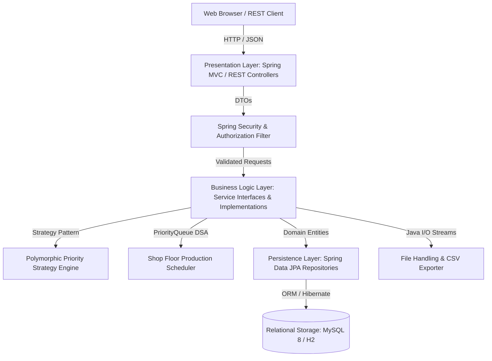

# System Architecture Documentation

## Smart Manufacturing Order Processing System
**Course:** Object Oriented Techniques using Java (CCSE0355)  
**Project Type:** Capstone / PBL Project  
**Team / Group:** 91  

---

## 1. High-Level Architectural Pattern

The Smart Manufacturing Order Processing System follows an enterprise-grade **Layered (N-Tier) Architectural Pattern** combined with **Domain-Driven Design (DDD)** concepts and behavioral design patterns.

---

## 2. Layer Breakdown & Responsibilities

### A. Presentation Layer (`com.smart.manufacturing.controller`)
* **Thymeleaf MVC Controllers**: Deliver server-rendered, responsive Bootstrap 5 HTML interfaces (`DashboardController`, `CustomerController`, `ProductController`, `InventoryController`, `OrderController`, `ProductionController`, `ReportController`, `UserController`).
* **REST API Controllers (`/api/*`)**: Expose stateless JSON endpoints adhering to RESTful standards for third-party systems, IoT telemetry, and integration testing.
* **Global Exception Handler (`@ControllerAdvice`)**: Unifies error formatting across MVC and REST requests, mapping domain exceptions to user-friendly alerts or HTTP 400/404/409 codes.

### B. Business Logic Layer (`com.smart.manufacturing.service`)
* Strictly decouples interface contracts (`OrderService`, `InventoryService`, etc.) from implementation details (`OrderServiceImpl`, etc.).
* Enforces invariants:
  * Non-negative stock validations
  * Multi-item order minimum constraint
  * State-machine lifecycle integrity (e.g. preventing direct transition from `CREATED` to `COMPLETED`)
  * Backend recalculation of VAT/GST taxes and grand totals.

### C. Behavioral Patterns & DSA Engine (`com.smart.manufacturing.strategy`)
* **Strategy Pattern (`PriorityStrategy`)**: Four concrete strategies (`LowPriorityStrategy`, `NormalPriorityStrategy`, `HighPriorityStrategy`, `UrgentPriorityStrategy`) define priority weights, lead time compressions, and expediting surcharges polymorphically.
* **Strategy Factory (`PriorityStrategyFactory`)**: Injects and maps strategies via Spring components and `EnumMap`.
* **DSA PriorityQueue Engine**: Utilizes `java.util.PriorityQueue<ManufacturingOrder>` configured with `OrderSchedulingComparator` to order tasks by Priority Weight &rarr; Deadline &rarr; FIFO Date.

### D. Persistence Layer (`com.smart.manufacturing.repository`)
* Leverages Spring Data JPA interfaces extending `JpaRepository`.
* Uses derived queries and JPQL queries with explicit indexing for high performance.

---

## 3. Core Domain Entities & Relationships

| Entity | Role in Architecture | Key Relationships |
| :--- | :--- | :--- |
| `BaseEntity` | Abstract Mapped Superclass for audit timestamps | Inherited by all entities |
| `Customer` | Commercial client placing manufacturing orders | `1:N` with `ManufacturingOrder` |
| `Product` | Manufactured catalog item | `1:1` with `Inventory`, `1:N` with `OrderItem` |
| `Inventory` | Physical on-hand, allocated, and safety stock | `1:1` with `Product` |
| `ManufacturingOrder` | Aggregate root representing customer order | `N:1` with `Customer`, `1:N` with `OrderItem`, `1:N` with `ProductionTask` |
| `OrderItem` | Discrete item line inside an order | `N:1` with `ManufacturingOrder`, `N:1` with `Product` |
| `ProductionTask` | Individual workstation task dispatched to shop floor | `N:1` with `ManufacturingOrder`, `N:1` with `Product` |
| `OrderStatusHistory` | Immutable lifecycle audit trail | `N:1` with `ManufacturingOrder`, `N:1` with `User` |

---

## 4. Security Architecture

* **Authentication**: Spring Security Form Login with `DaoAuthenticationProvider` and `UserDetailsService`.
* **Password Hashing**: Cryptographically salted BCrypt hashing algorithm (`BCryptPasswordEncoder`). Passwords are never stored in plain text.
* **Role-Based Access Control (RBAC)**:
  * `ROLE_ADMIN`: Complete access to all entities, user administration, and system settings.
  * `ROLE_PRODUCTION_MANAGER`: Full management of production schedules, tasks, and order routing.
  * `ROLE_ORDER_STAFF`: Customer entry, product catalog viewing, and order placement.
  * `ROLE_INVENTORY_COORDINATOR`: Warehouse inventory monitoring, stock adjustments, and material audits.
  * `ROLE_SUPERVISOR`: Read-only operational oversight of dashboards, reports, and production progress.
