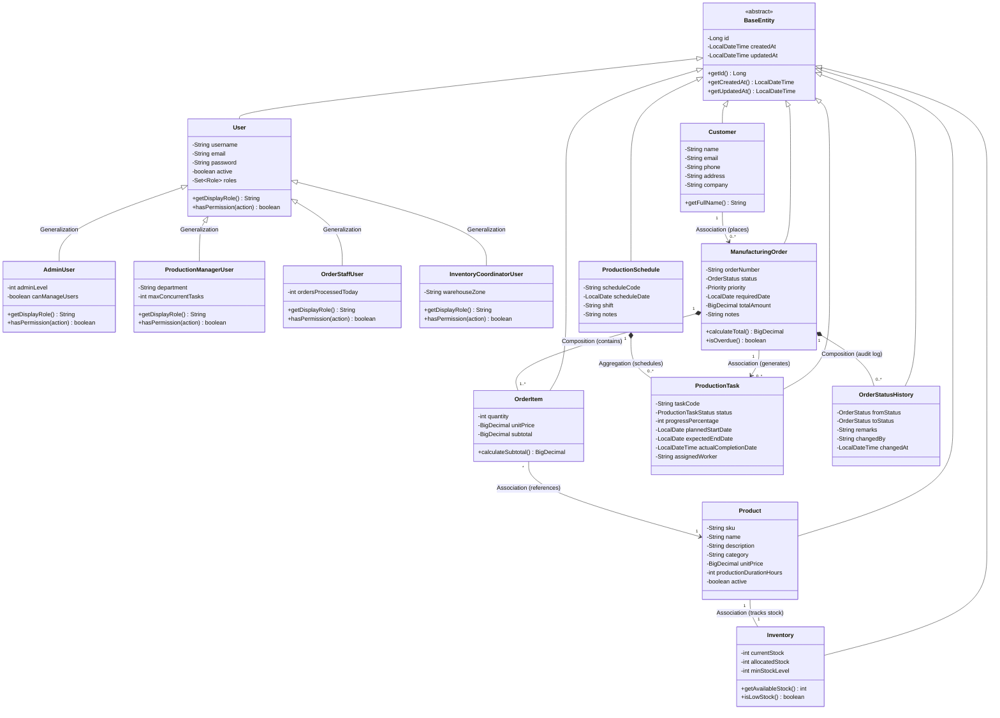

# UML Class Diagram — Smart Manufacturing Order Processing System

## 1. Domain Entities & Inheritance Hierarchy

```mermaid
classDiagram
    %% Base Mapped Superclass
    class BaseEntity {
        <<abstract>>
        -Long id
        -LocalDateTime createdAt
        -LocalDateTime updatedAt
        +getId() Long
        +getCreatedAt() LocalDateTime
        +getUpdatedAt() LocalDateTime
    }

    %% User Hierarchy (Single Table Inheritance)
    class User {
        -String username
        -String email
        -String password
        -boolean active
        -Set~Role~ roles
        +getDisplayRole() String
        +hasPermission(action) boolean
    }

    class AdminUser {
        -int adminLevel
        -boolean canManageUsers
        +getDisplayRole() String
        +hasPermission(action) boolean
    }

    class ProductionManagerUser {
        -String department
        -int maxConcurrentTasks
        +getDisplayRole() String
        +hasPermission(action) boolean
    }

    class OrderStaffUser {
        -int ordersProcessedToday
        +getDisplayRole() String
        +hasPermission(action) boolean
    }

    class InventoryCoordinatorUser {
        -String warehouseZone
        +getDisplayRole() String
        +hasPermission(action) boolean
    }

    BaseEntity <|-- User
    User <|-- AdminUser : Generalization
    User <|-- ProductionManagerUser : Generalization
    User <|-- OrderStaffUser : Generalization
    User <|-- InventoryCoordinatorUser : Generalization

    %% Core Business Entities
    class Customer {
        -String name
        -String email
        -String phone
        -String address
        -String company
        +getFullName() String
    }

    class Product {
        -String sku
        -String name
        -String description
        -String category
        -BigDecimal unitPrice
        -int productionDurationHours
        -boolean active
    }

    class Inventory {
        -int currentStock
        -int allocatedStock
        -int minStockLevel
        +getAvailableStock() int
        +isLowStock() boolean
    }

    class ManufacturingOrder {
        -String orderNumber
        -OrderStatus status
        -Priority priority
        -LocalDate requiredDate
        -BigDecimal totalAmount
        -String notes
        +calculateTotal() BigDecimal
        +isOverdue() boolean
    }

    class OrderItem {
        -int quantity
        -BigDecimal unitPrice
        -BigDecimal subtotal
        +calculateSubtotal() BigDecimal
    }

    class ProductionSchedule {
        -String scheduleCode
        -LocalDate scheduleDate
        -String shift
        -String notes
    }

    class ProductionTask {
        -String taskCode
        -ProductionTaskStatus status
        -int progressPercentage
        -LocalDate plannedStartDate
        -LocalDate expectedEndDate
        -LocalDateTime actualCompletionDate
        -String assignedWorker
    }

    class OrderStatusHistory {
        -OrderStatus fromStatus
        -OrderStatus toStatus
        -String remarks
        -String changedBy
        -LocalDateTime changedAt
    }

    BaseEntity <|-- Customer
    BaseEntity <|-- Product
    BaseEntity <|-- Inventory
    BaseEntity <|-- ManufacturingOrder
    BaseEntity <|-- OrderItem
    BaseEntity <|-- ProductionSchedule
    BaseEntity <|-- ProductionTask
    BaseEntity <|-- OrderStatusHistory

    %% Relationships
    Customer "1" --> "0..*" ManufacturingOrder : Association (places)
    ManufacturingOrder "1" *-- "1..*" OrderItem : Composition (contains)
    OrderItem "*" --> "1" Product : Association (references)
    Product "1" -- "1" Inventory : Association (tracks stock)
    ManufacturingOrder "1" --> "0..*" ProductionTask : Association (generates)
    ProductionSchedule "1" *-- "0..*" ProductionTask : Aggregation (schedules)
    ManufacturingOrder "1" *-- "0..*" OrderStatusHistory : Composition (audit log)
```

---

## 2. Abstraction & Realization (Services & Strategies)

```mermaid
classDiagram
    %% Service Abstractions
    class OrderService {
        <<interface>>
        +getAllOrders() List
        +getOrderById(id) ManufacturingOrder
        +createOrder(dto, user) ManufacturingOrder
        +validateOrder(id, user) ManufacturingOrder
        +approveOrder(id, user) ManufacturingOrder
        +scheduleOrder(id, user) ManufacturingOrder
        +startProduction(id, user) ManufacturingOrder
        +completeOrder(id, user) ManufacturingOrder
    }
    class OrderServiceImpl {
        -ManufacturingOrderRepository orderRepo
        -InventoryService inventoryService
        -SchedulingService schedulingService
    }
    OrderService <|.. OrderServiceImpl : Realization

    class InventoryService {
        <<interface>>
        +addStock(productId, qty, user) Inventory
        +removeStock(productId, qty, user) Inventory
        +allocateStock(productId, qty, orderId) void
        +releaseStock(productId, qty, orderId) void
    }
    class InventoryServiceImpl
    InventoryService <|.. InventoryServiceImpl : Realization

    %% Scheduling Strategy Pattern
    class SchedulingStrategy {
        <<interface>>
        +schedule(orders) PriorityQueue
        +getStrategyName() String
        +getDescription() String
    }
    class PrioritySchedulingStrategy {
        +schedule(orders) PriorityQueue
    }
    class DeadlineSchedulingStrategy {
        +schedule(orders) PriorityQueue
    }
    class BalancedSchedulingStrategy {
        +schedule(orders) PriorityQueue
    }
    SchedulingStrategy <|.. PrioritySchedulingStrategy : Realization
    SchedulingStrategy <|.. DeadlineSchedulingStrategy : Realization
    SchedulingStrategy <|.. BalancedSchedulingStrategy : Realization

    %% Abstract Order Processor (Template Method)
    class AbstractOrderProcessor {
        <<abstract>>
        #String processorName
        #List~String~ processingLog
        +process(order) ProcessingResult
        #validate(order)* void
        #execute(order)* ProcessingResult
        #postProcess(order, result) void
        +getSummary() String
        +getSummary(detailed) String
    }
    class ValidationOrderProcessor {
        #validate(order) void
        #execute(order) ProcessingResult
    }
    class PriorityOrderProcessor {
        -int urgencyThresholdDays
        #validate(order) void
        #execute(order) ProcessingResult
    }
    AbstractOrderProcessor <|-- ValidationOrderProcessor : Inheritance
    AbstractOrderProcessor <|-- PriorityOrderProcessor : Inheritance
```
