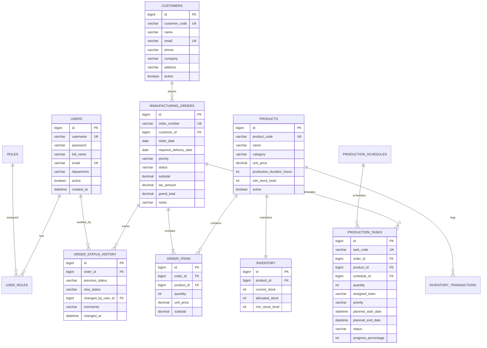

# Database Design & Relational Schema

## Smart Manufacturing Order Processing System
**Database Engine:** MySQL 8.0 (with H2 embedded fallback)  
**Schema Model:** 3rd Normal Form (3NF) Relational Architecture  

---

## 1. Entity-Relationship Diagram (ERD)

---

## 2. Table Specifications & Normalization Details

### 2.1 Table: `users` & `roles`
* Implements a standard Many-to-Many join table `user_roles` to support flexible multi-role authorizations.
* Passwords stored exclusively as BCrypt salted hash strings ($2a$10$...).

### 2.2 Table: `products` & `inventory`
* Strict **1-to-1 relationship** between `products` and `inventory`.
* `inventory.allocated_stock` keeps track of materials committed to approved orders, preventing overselling without needing destructive physical stock drops until manufacturing completes.
* Formula for Available Stock: `available_stock = current_stock - allocated_stock`.

### 2.3 Table: `manufacturing_orders` & `order_items`
* `1-to-Many` relationship with cascade deletion.
* Financial totals (`subtotal`, `tax_amount`, `grand_total`) are stored in `manufacturing_orders` with precision `DECIMAL(12, 2)` to eliminate floating-point rounding inaccuracies.

### 2.4 Table: `order_status_history`
* Append-only audit trail logging every state transition with timestamp and executing staff member ID.

---

## 3. Indexing & Query Optimization Strategy

1. **`idx_customers_name` & `idx_customers_company`**: Speeds up dynamic customer search autocomplete.
2. **`idx_products_category`**: Optimizes category-filtered catalog lookups.
3. **`idx_orders_status` & `idx_orders_priority`**: Accelerates dashboard aggregation counts and queue queries.
4. **`idx_tasks_status`**: Provides rapid lookup of active versus delayed shop floor tasks.
