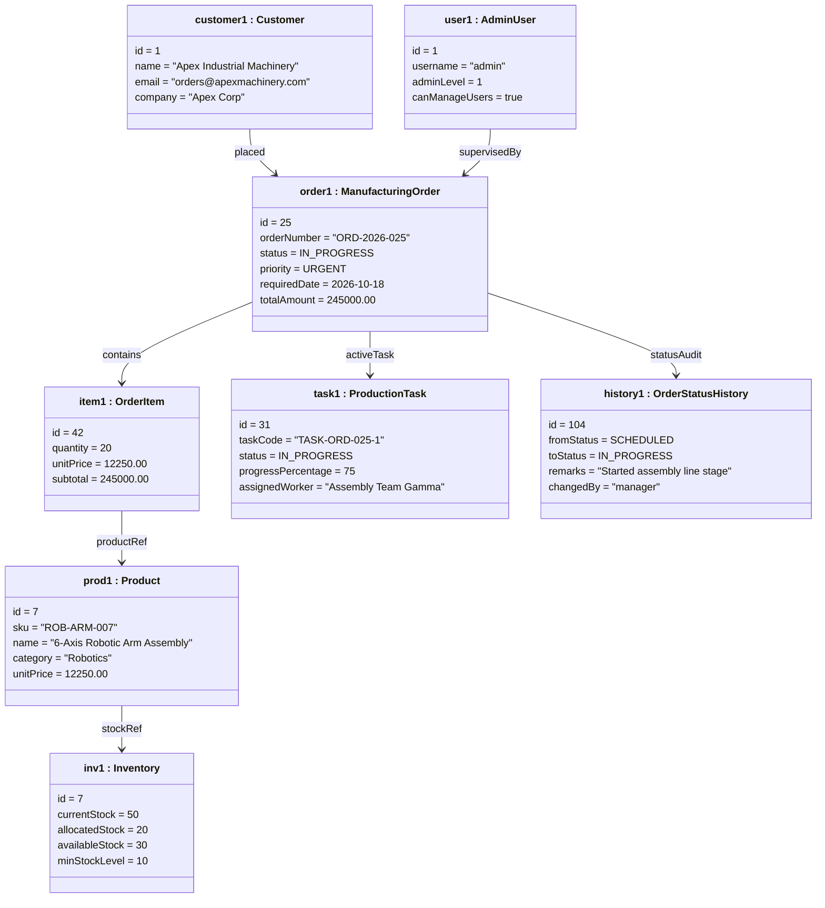

# UML Object Diagram — Runtime Instance Example

This document provides a concrete runtime snapshot of objects in heap memory during the lifecycle of an urgent manufacturing order.

---

## 1. Runtime Object Graph



---

## 2. PriorityQueue Heap State (DSA Demonstration)

When the production scheduler evaluates the active backlog via `PriorityQueue<ManufacturingOrder>` with `OrderSchedulingComparator`:

```
                    [ Root / Peek ]
                 ORD-2026-025 (URGENT)
                 Deadline: 2026-10-18
                      /        \
                     /          \
           ORD-2026-012        ORD-2026-004
             (URGENT)             (HIGH)
        Deadline: 2026-10-22   Deadline: 2026-10-14
```

### Dequeue Sequence:
1. **ORD-2026-025**: Priority weight = 4 (URGENT), Deadline: 2026-10-18 (processed 1st)
2. **ORD-2026-012**: Priority weight = 4 (URGENT), Deadline: 2026-10-22 (processed 2nd)
3. **ORD-2026-004**: Priority weight = 3 (HIGH), Deadline: 2026-10-14 (processed 3rd)
